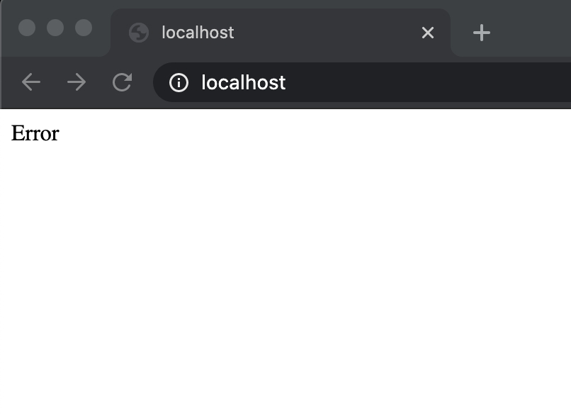

# Rate Limit Test

面試在家作業。

## 需求

1. 每個 ip 每分鐘僅能接受 60 個 request。
1. 在首頁顯示目前的 request 量,超過限制的話則顯示 “Error”,例如在一分鐘內第 30 個 request 則顯示 30,第 61 個request 則顯示 Error.

## 儲存與計算
預設使用 memory 的儲存與計算方式。

設計了 memory 的 interface， 可以在使用時自行指定各種儲存的方法。

``` TypeScript
interface BaseRateLimitStore {
  // 增加 client 呼叫的次數
  async increase: (clientKey: string) => Promise<number>;

  // 清除 store 中的紀錄，
  // 若在 cluster 的架構中， 可以將該函數留空，交由某個控制 service 進行清除的控制
  async clear: () => Promise
}
```

## 執行

> npm start

## 測試

> npm test

## 截圖

1. 一般情況

2. 60次

3. 61次或以上

